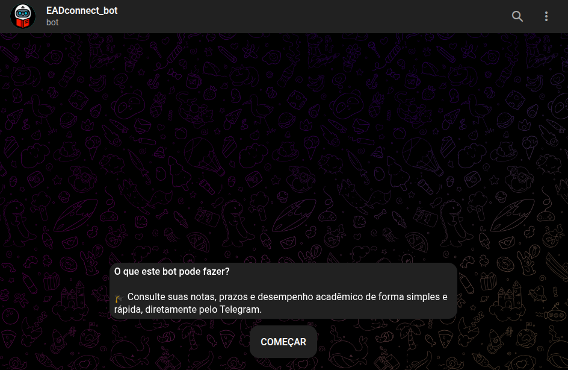

# 📚 EAD Connect Bot

---

<p align="center">
  <a href="https://github.com/cleitonleonel/SmartBot">
    
  </a>
</p>

<p align="center">
  <i>🎓 Consulte suas notas, prazos e desempenho acadêmico de forma simples e rápida, diretamente pelo Telegram.</i>
</p>

Um bot do [Telegram](https://t.me/EADconnectBot) desenvolvido em [Python](https://www.python.org/), utilizando a biblioteca [SmartBot](https://github.com/cleitonleonel/SmartBot.git), com foco em **automatizar o processo de autenticação e navegação em plataformas de educação a distância (EAD)**.

---

## ✨ Principais funcionalidades

- 🔐 Gerencia o fluxo de login de usuários (usuário/senha).
- 🤖 Interface interativa com botões inline.
- 🧠 Controle de estado do usuário (ex: aguardando login, senha, sessão ativa).
- 📡 Integração com API externa de autenticação (`eadconnect.utils.auth`).
- 📂 Menus personalizados e adaptativos conforme o estado do usuário.
- 🧱 Estrutura modular com separação de `commands`, `callbacks`, `helpers`, etc.
- 🧪 Scripts de teste (ex: `tests/generate_grades.py`).
- 🖼️ Suporte a mídia, fontes customizadas e geração de relatórios (`pdfs/`).

---

## 💠 Tecnologias utilizadas

- Python 3.12
- [Telethon](https://web.telegram.org/)
- [Poetry](https://python-poetry.org/) (gerenciador de dependências)
- `toml` para configuração
- SQLite / Sessões persistentes via arquivo `.session`

---

## 📁 Estrutura do projeto

```
.
├── main.py                  # Ponto de entrada do bot
├── config.toml             # Configuração principal
├── plugins/                # Handlers de comandos e callbacks
├── eadconnect_bot/         # Módulo base
├── helpers/                # Utilitários e botões
├── src/                    # Recursos estáticos (fonts, imagens, pdfs)
├── tests/                  # Scripts auxiliares
└── sessions/               # Sessões persistidas do Telethon
```

---

## 🚀 Como rodar o projeto

1. **Clone o repositório:**

```bash
git clone https://github.com/cleitonleonel/EADConnect_Bot.git
cd EADConnect_Bot
```

2. **Configure o ambiente com Poetry:**

```bash
poetry install
poetry shell
```

3. **Configure o arquivo:**

Crie ou edite o arquivo `config.toml` com os seguintes campos:

```toml
[API]
# Acesse https://my.telegram.org/auth
ID = 123456 # ID Telegram
HASH = "API Hash Telegram"
BOT_TOKEN = "Token do Bot criado via BotFather"

[ADMIN]
IDS = [2222222222] # IDs dos chats admin

[APPLICATION]
APP_NAME = "SmartBot"
APP_AUTHOR = "Cleiton Leonel Creton"
APP_VERSION = "0.1.0"
DEVICE_MODEL = "Telegram Desktop 5.1.7 Snap"
SYSTEM_VERSION = "Linux Ubuntu GNOME"
```

4. **Execute o bot:**

```bash
python main.py
```

---

## ⚙️ Configuração alternativa (dev)

Você pode usar o `config_dev.toml` para sobrepor variáveis durante o desenvolvimento.

---

## 🔐 Autenticação

O bot usa integração com a API `eadconnect.utils.auth`, que espera endpoints REST para:

- `POST /login`
- `GET /grades`
- `GET /materials`
- etc...

Configure corretamente as rotas no seu backend ou mock para testes.

---

## 📸 Captura de tela
<p align="center">
  
</p>

## 📄 Licença

Distribuído sob a licença [MIT](w). Veja o arquivo [`LICENSE`](./LICENSE) para mais detalhes.

---

## 🤝 Contribuindo

Contribuições são bem-vindas! Sinta-se livre para abrir issues ou enviar pull requests.

---

## ✉️ Contato

Criado por **Cleiton Leonel Creton**\
🔗 [LinkedIn](https://www.linkedin.com/in/cleiton-leonel-creton-331138167/)\
🐙 [GitHub](https://github.com/cleitonleonel)

---

